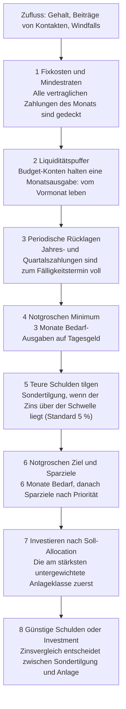
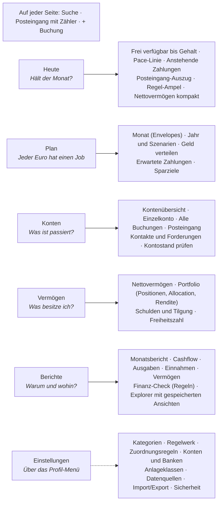
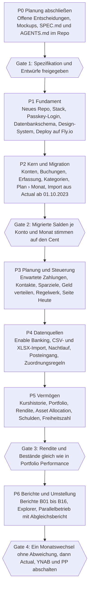

# Finanz-App V1 – Produktkonzept & Spezifikation

Stand: 28.09.2026 · Autor: Eigentümer

> Export des Claude-Docs. Die vier Diagramme des Originals sind hier als Mermaid-Blöcke nachgebaut.

## 1 Executive Summary und Entscheidungslog

Wir bauen die Finanz-App als eigenständige Web-App mit eigener Datenbank (Option B). Den Kern bildet Envelope-Budgeting nach YNAB-Prinzip. Darauf liegt ein Regelwerk aus Finanz-Basics (50/30/20, Notgroschen, Geldfluss-Wasserfall). Dazu kommt vollständiges Vermögens- und Portfolio-Tracking inklusive Ablöse von Portfolio Performance schon in V1. Leitziel ist, Cashflow und Vermögen nicht nur zu tracken, sondern aktiv zu optimieren. Finanzdaten starten am 01.10.2023, Kursdaten übernehmen wir vollständig.

**Mockups:** 31 Screens für Desktop und Handy, alle mit Beispieldaten (siehe Ordner `03_Mockups`).

| # | Thema | Entscheidung | Folge |
| --- | --- | --- | --- |
| 1.1 | Architektur | Eigenbau, völlig unabhängig von Actual | Actual und Sure dienen als Referenz für Modell und Algorithmen, nicht als Laufzeit |
| 1.2 | Nutzer | Single-User. Partner und andere Personen sind Kontakte ohne eigenen Login | Eine spätere App-zu-App-Verknüpfung für Forderungen bleibt im Datenmodell möglich, ist aber nicht in V1 |
| 1.3 | Budget-Methode | Envelope im Kern, Monatsziele und Pace als Steuerung, 50/30/20 und Regeln als Auswertung | Siehe Vergleich unten |
| 1.4 | Stichtag | 01.10.2023 mit Eröffnungssalden, kein Archiv | Kurshistorie aller Wertpapiere vollständig, auch vor dem Stichtag |
| 1.5 | Scope V1 | Budget, Vermögen und Portfolio komplett inkl. TTWROR/IRR, Asset Allocation, Benchmark | V1 wird größer, daher Umsetzung in Paketen (Kapitel 12) |
| 1.6 | Login | Passkeys (Face ID, Touch ID, Windows Hello), Wiederherstellungscodes als Notfall | Google-Login optional als Zweitweg |

### Brauchen wir Actuals Updatefähigkeit?

Nein. Actual-Updates liefern Bugfixes am Budgetkern, neue Oberflächen und Bankanbindungen. Den Budgetkern ersetzen wir durch eigene, getestete Logik, die Oberfläche nutzen wir nicht mehr. Echter Verlust ist nur die fertige Bankanbindung. Enable Banking binden wir deshalb direkt an (PSD2, Kapitel 11).

Sure bringt keine Actual-Updates mit. Es entwickelt sich unabhängig und bietet nur einen einmaligen Actual-Import. Ein Sure-Fork wäre nach den ersten eigenen Anpassungen (Envelope-Logik) ebenfalls nicht mehr updatefähig. Sure-Updates würden wir also genauso verlieren.

### Envelope vs. Ausgabenlimit

| Merkmal | Envelope (YNAB, Actual) | Ausgabenlimit (Sure, Copilot, Monarch) |
| --- | --- | --- |
| Basis | Geld, das tatsächlich auf den Konten liegt | Erwartetes Einkommen |
| Kernfrage | Welchen Job hat jeder vorhandene Euro? | Wie viel darf ich in Kategorie X ausgeben? |
| Nicht ausgegeben | Bleibt in der Kategorie (Rollover) | Verfällt, Rollover optional |
| Überzogen | Muss aus einer anderen Kategorie gedeckt werden | Wird nur angezeigt |
| „Zu verteilen“ | Zentrale Größe, Ziel ist 0 | Gibt es nicht |
| Stärke | Disziplin, reale Liquidität | Einfach, gut für Prognosen |

Unser Hybrid: Envelope bestimmt, was verfügbar ist. Aus den Zielen je Kategorie entsteht ein Monatslimit. Die Pace-Linie zeigt täglich, ob du über oder unter Plan liegst. So bekommst du die Copilot-Sicht („760 € von 3.000 €“), ohne das Envelope-Prinzip aufzugeben.

### Warum Passkeys statt Google-Login

Für einen einzelnen Nutzer sind Passkeys einfacher: keine OAuth-App bei Google, keine Redirect-URIs, keine E-Mail-Allowlist. Face ID funktioniert auch in der installierten iPhone-PWA. „Sign in with Apple“ setzt eine kostenpflichtige Apple-Developer-Mitgliedschaft voraus. Vorschlag: Session 30 Tage auf registrierten Geräten, erneute Bestätigung bei sensiblen Aktionen (Export, Bank verbinden, Passkey hinzufügen).

## 2 Vision, Ziele, Prinzipien

**Vision:** Eine private Haushalts-Finanz-App. Sie erfasst eine Buchung in 10 Sekunden und beantwortet in 5 Sekunden, ob der Monat hält. Am Desktop steuert sie Planung, Schulden und Vermögen vollständig.

### Ziele

| Ziel | Leitfrage | Messgröße (Kapitel 8) |
| --- | --- | --- |
| Cashflow sichern | Hält der Monat, hält das Konto bis zum nächsten Gehalt? | Frei verfügbar bis Gehalt, Pace, Tiefpunkt-Prognose |
| Cashflow optimieren | Wohin fließt das Geld, was lässt sich umlenken? | Sparquote, 50/30/20-Ist, Fixkostenquote |
| Vermögen tracken | Wie entwickelt sich das Nettovermögen und warum? | Nettovermögen, Zu- und Abflüsse vs. Marktveränderung |
| Vermögen optimieren | Ist das Geld richtig verteilt, wohin soll der nächste Euro? | Asset Allocation Soll/Ist, Rendite, Schuldenquote |
| Vorausschauen | Was kommt in 1, 3, 12 Monaten auf uns zu? | Liquiditätsprognose, Jahresausgaben-Deckung |

### Prinzipien

1. **Eine App, eine Datenbasis, eine Sprache.** Keine Fremdbegriffe wie „Abgleichbuchung“ oder „cleared“. Jeder Begriff steht im Glossar.
2. **Generisch statt personenbezogen.** Personen, Institutionen, Konten, Kategorien und Regeln sind Daten, nie Code. Kein Name steht im Quelltext.
3. **Envelope im Kern.** Jeder vorhandene Euro hat genau einen Job. Plan ist zukünftige Verwendung, Ist sind Buchungen.
4. **Erwartbares ist Plan.** Gehalt, Beiträge von Kontakten, Abos und Jahreszahlungen sind versionierte, erwartete Zahlungen mit Status.
5. **Regeln statt Bauchgefühl.** Finanz-Basics sind als konfigurierbares Regelwerk hinterlegt und werden laufend geprüft.
6. **Mobil erfassen, Desktop steuern.** Beide Geräte haben dieselbe Sitemap, sie unterscheiden sich nur in der Tiefe.
7. **Jede Zahl ist erklärbar.** Jede Kennzahl lässt sich bis zur einzelnen Buchung aufklappen.
8. **Automatisch, wo es zuverlässig ist.** Bank-Sync und Kurse laufen automatisch. Manuelle Eingabe ist ein gleichwertiger Weg, kein Notbehelf.
9. **Nichts verschwindet stillschweigend.** Jede Änderung ist protokolliert und rückgängig machbar.

### Nicht in V1 (Non-Goals)

Steuer (Arbeitnehmerveranlagung, KESt-Berechnung), KI-Beratung oder KI-Kategorisierung, Fahrzeug- und Immobilienbewertung, Mehrbenutzer und Partner-Verknüpfung, native App, Kompatibilität zu Actual. Der generische Kontotyp „Sonstiges Vermögen“ mit manueller Bewertung hält die Tür für eine spätere Immobilie samt Kredit offen.

## 3 Finanzmethodik und Regelwerk

Die App rechnet nach fünf Bausteinen: Envelope-Kern, dreistufiges Kategoriensystem, erwartete Zahlungen, Kontakte mit Forderungen und ein konfigurierbares Regelwerk. Der Geldfluss-Wasserfall verbindet sie und beantwortet, wohin der nächste freie Euro fließt.

### 3.1 Envelope-Kern

- **Budget-Konten** (Giro, Bargeld, Kreditkarte, Tagesgeld für Puffer und Notgroschen) bilden das verteilbare Geld. **Tracking-Konten** (Depot, Krypto, P2P, Kredit, Forderungen, Sonstiges Vermögen) zählen nur zum Vermögen.
- **Zu verteilen** = Summe der Budget-Konten minus Summe aller verfügbaren Envelopes. Zielwert ist 0.
- Einnahmen landen in „Zu verteilen“. Mit Regel R03 verteilst du erst am Monatsanfang, was im Vormonat eingegangen ist.
- Nicht Ausgegebenes bleibt im Envelope. Überziehen ist erlaubt, muss aber aus einem anderen Envelope gedeckt werden. Ungedeckt mindert es „Zu verteilen“ im Folgemonat.
- Kreditkarten: Jede Kartenausgabe verschiebt den Betrag automatisch aus der Kategorie in den Envelope „Kartenzahlung“. Die Abrechnung ist dann schon gedeckt.
- Umbuchungen zwischen Budget-Konten sind budgetneutral. Umbuchungen auf Tracking-Konten brauchen eine Kategorie, zum Beispiel „Investieren“.

### 3.2 Kategoriensystem

Jede Kategorie hat drei Ebenen und drei Eigenschaften. Die Klasse ordnet sie 50/30/20 zu. Die Art bestimmt, wie sie geplant wird.

| Ebene | Standardwerte | Beispiel |
| --- | --- | --- |
| Klasse | Bedarf (50), Wunsch (30), Zukunft (20) | Bedarf |
| Gruppe | Wohnen, Lebensmittel, Mobilität, Versicherungen, Gesundheit, Kinder, Kredite, Genuss, Freizeit, Reisen, Abos, Geschenke, Notgroschen, Sparziele, Investieren | Wohnen |
| Kategorie | frei anlegbar, mit Farbe und Icon | Strom |

| Art | Definition | Planung |
| --- | --- | --- |
| Fix | Betrag und Termin vertraglich, monatlich | Aus erwarteter Zahlung, automatisch |
| Periodisch | Vertraglich, aber nicht monatlich (Jahresversicherung, Service, Weihnachten) | Monatliche Rücklage = offener Betrag / Monate bis Fälligkeit |
| Variabel | Höhe schwankt (Lebensmittel, Treibstoff) | Monatsziel aus Durchschnitt oder frei gesetzt |

Fixkosten für die Fixkostenquote sind Fix plus periodische Rücklagen. Kreditraten sind geteilt: Die Mindestrate zählt als Bedarf, die Sondertilgung als Zukunft. **Einnahmenarten** sind eine eigene Liste: Gehalt, Sonderzahlung, Beiträge von Kontakten, Kapitalerträge, Erstattungen, Geschenke, Sonstiges.

### 3.3 Erwartete Zahlungen

Eine erwartete Zahlung beschreibt alles, was regelmäßig kommt oder geht: Gehalt, Miete, Abos, Beiträge von Kontakten, Jahresversicherungen.

- **Felder:** Name, Gegenseite (Empfänger oder Kontakt), Konto, Kategorie oder Einnahmenart, Betrag fix oder als Spanne, Rhythmus, Terminregel (zum Beispiel „letzter Werktag, bei Wochenende oder Feiertag davor“).
- **Versioniert:** Jede Änderung gilt ab einem Monat. Sinkt ein Beitrag ab März, rechnen Plan und Prognose ab März mit dem neuen Wert. Die Vergangenheit bleibt unverändert.
- **Status je Vorkommen:** erwartet, eingegangen, abweichend, ausgefallen. Eine Buchung wird über Betragstoleranz und Datumsfenster zugeordnet.
- Erwartete Einnahmen sind **kein Geld zum Verteilen**, bevor sie eingehen. Sie fließen aber in Prognose und Pace ein.

### 3.4 Kontakte und Forderungen

Ein Kontakt ist jede Person oder Organisation, mit der Geld hin- und hergeht, zum Beispiel Partnerin, Freunde oder Arbeitgeber für Spesen. Jeder Kontakt hat ein eigenes Forderungskonto als Tracking-Konto.

1. **Auslage:** Ein Split-Anteil wird einem Kontakt statt einer Kategorie zugeordnet. Der Betrag verlässt das Budget über den Envelope „Auslagen“ und erhöht die Forderung.
2. **Durchgereichte Kosten:** Ein Abo, das du für einen Kontakt bezahlst, ist eine erwartete Zahlung mit Anteil 100 % für diesen Kontakt.
3. **Beitrag:** Ein regelmäßiger Beitrag eines Kontakts (etwa zur Miete) ist eine erwartete Einnahme mit Einnahmenart „Beiträge von Kontakten“.
4. **Ausgleich:** Ein Zahlungseingang vom Kontakt wird auf offene Posten verteilt und füllt „Auslagen“ wieder auf. Die Monatsabrechnung zeigt je Kontakt offen, bezahlt und Differenz.

Damit entfallen die Felder Person, Rückforderung und Spese in der Buchungserfassung. Spesen laufen über den Kontakt „Arbeitgeber“.

### 3.5 Regelwerk

Jede Regel hat konfigurierbare Schwellen, einen Status (erfüllt, Warnung, verletzt) und eine konkrete Maßnahme. Die Regeln sind Daten mit Typ und Parametern, keine Sonderlogik im Code.

| ID | Regel | Standard-Schwelle | Bezug |
| --- | --- | --- | --- |
| R01 | 50/30/20 | Bedarf ≤ 50 %, Wunsch ≤ 30 %, Zukunft ≥ 20 % vom Nettoeinkommen | Monat und rollierend 12 Monate |
| R02 | Notgroschen | Minimum 3, Ziel 6 Monate Bedarf-Ausgaben | Notgroschen-Konten |
| R03 | Vom Vormonat leben | Budget-Konten decken am Monatsanfang die Ausgaben des ganzen Monats | Geldalter ≥ 30 Tage |
| R04 | Pay yourself first | Zukunft-Envelopes werden am Gehaltstag zuerst gefüllt | Gehaltseingang |
| R05 | Sinking Funds | Jede periodische Ausgabe ist bei Fälligkeit voll finanziert | Periodische Kategorien |
| R06 | Kreditkarte | Kartensaldo ist immer durch „Kartenzahlung“ gedeckt | Kreditkarten-Konten |
| R07 | Dispo | Dispo ist nie Teil des Plans, Tiefpunkt-Prognose ≥ 0 | Giro |
| R08 | Schuldenquote | Kreditraten ≤ 30 % vom Nettoeinkommen | Kredite |
| R09 | Tilgungsreihenfolge | Zins über 5 %: Sondertilgung vor Investment (Avalanche), Snowball wählbar | Kredite |
| R10 | Fixkostenquote | Fix plus periodisch ≤ 55 % vom Nettoeinkommen | Kategorien |
| R11 | Lifestyle-Inflation | Ausgabenwachstum ≤ Einkommenswachstum, rollierend 12 Monate | Einnahmen, Ausgaben |
| R12 | Windfall | 10 % für Genuss, Rest nach Wasserfall | Einnahmenart Sonderzahlung, Geschenk, Verkauf |
| R13 | Asset Allocation | Rebalancing, wenn eine Klasse 5 Prozentpunkte oder 25 % relativ vom Soll abweicht | Portfolio |
| R14 | Klumpenrisiko | Einzeltitel ≤ 10 %, einzelne P2P- oder Krypto-Plattform ≤ 20 % des Investments | Portfolio |
| R15 | Spekulativer Anteil | Krypto, P2P und Einzelaktien zusammen ≤ 10 % des Investments | Portfolio |
| R16 | Freiheitszahl | Fortschritt = investiertes Vermögen / (Jahresausgaben × 25) | Vermögen |

Alle Schwellen sind Vorschläge und in den Einstellungen änderbar. Regeln lassen sich einzeln abschalten.

### 3.6 Geldfluss-Wasserfall

Jeder freie Euro läuft die Stufen hinab, bis eine Stufe nicht gefüllt ist.



Der Wasserfall steuert den Gehaltstag, Windfalls und den Vorschlag „Wohin mit dem Überschuss“. Bei einer Entnahme aus dem Vermögen gilt die umgekehrte Richtung: zuerst aus der am stärksten übergewichteten Anlageklasse.

### 3.7 Glossar (Auszug)

| Begriff in der App | Bedeutung | Ersetzt |
| --- | --- | --- |
| Zu verteilen | Geld auf Budget-Konten ohne Job | To Be Budgeted |
| Verfügbar | Rest im Envelope | Available, Balance |
| Bestätigt | Buchung von der Bank gemeldet, automatisch gesetzt | Cleared, „Bei Bank gebucht“ |
| Kontostand prüfen | App-Saldo mit Bank-Saldo vergleichen und festschreiben | Abgleich, Reconcile |
| Erwartet | Geplante, noch nicht eingegangene Zahlung | Schedule |

## 4 Prozesse

Die App trägt acht Routinen. Die täglichen laufen automatisch. Von dir brauchen sie etwa 10 Minuten pro Woche und 30 Minuten zum Monatswechsel. Jede Routine hat in der App einen geführten Ablauf mit Fortschrittsanzeige statt verstreuter Einzelseiten.

| Rhythmus | Routine | Schritte | Wo | Aufwand |
| --- | --- | --- | --- | --- |
| Täglich, automatisch | Nachtlauf | Bank-Sync (2 × täglich), Kurse und Wechselkurse, erwartete Zahlungen zuordnen, Umbuchungen und Dubletten erkennen, Regeln prüfen | Server | 0 |
| Laufend, mobil | Erfassen | Barzahlung oder Auslage erfassen, Beleg fotografieren, Blick auf „Heute“ | Mobil | 10 s je Buchung |
| Wöchentlich | Posteingang leeren | Neue Buchungen bestätigen oder kategorisieren, Vorschläge für Umbuchung und Dublette entscheiden, Pace prüfen | Mobil oder Desktop | 10 min |
| Gehaltstag | Geld verteilen | „Zu verteilen“ mit dem Wasserfall-Assistenten auf Envelopes, Sparziele und Investments verteilen | Desktop oder Mobil | 5 min |
| Monatswechsel | Monatsabschluss | Kontostände prüfen, manuelle Werte aktualisieren (P2P, Sonstiges), Überziehungen decken, Kontakte abrechnen, Monatsbericht lesen | Desktop | 30 min |
| Quartal | Portfolio-Review | Allocation und Rebalancing, Abo-Preisänderungen, Ziele anpassen, Bank-Einwilligungen erneuern (alle 180 Tage) | Desktop | 30 min |
| Jährlich | Jahresplanung | Periodische Ausgaben und Sonderzahlungen planen, Jahresbericht, Verträge und Versicherungen prüfen, Kategorien aufräumen, Wiederherstellung einer Sicherung testen | Desktop | 2 h |
| Ereignis | Lebensereignis | Szenario anlegen (Gehaltsänderung, Karenz, Teilzeit), Auswirkung vergleichen, ab Monat übernehmen | Desktop | nach Bedarf |

Der Posteingang ist die zentrale Arbeitsliste. Alles, was eine Entscheidung braucht, landet dort: unkategorisierte Buchungen, Vorschläge, abweichende erwartete Zahlungen, Regelverletzungen, veraltete Werte und ablaufende Bank-Einwilligungen.

## 5 Datenmodell

Eine relationale Datenbank ersetzt Actual-SQLite und den verschlüsselten JSON-Arbeitsbereich. Das Modell folgt für Konten, Salden, Vermögen und wiederkehrende Zahlungen dem Schema von Sure. Für Budget und Envelopes folgt es Actual und YNAB. Alles hängt an einer Instanz (`household`), damit eine spätere Mehrmandantenfähigkeit möglich bleibt.

Sechs Domänen in einer Datenbank, Buchungen sind der Kern:

```mermaid
flowchart LR
    subgraph Stammdaten
      Institution; Konto["Konto (Budget/Tracking)"]; Kontakt; Empfaenger[Empfänger]; Einnahmenart; Waehrung["Währung, Wechselkurs"]
    end
    subgraph Buchungen
      Buchung; Anteil["Anteil (Split)"]; Umbuchung["Umbuchung (Paar)"]; Beleg; ImportLauf[Import-Lauf]; Kontopruefung[Kontoprüfung]
    end
    subgraph Budget
      Klasse["Klasse (50/30/20)"]; Gruppe; Kategorie; Zuweisung[Monatszuweisung]; Ziel[Ziel je Kategorie]
    end
    subgraph Planung
      Erwartet[Erwartete Zahlung]; Version["Version (gültig ab)"]; Vorkommen[Vorkommen mit Status]; Sparziel; Szenario
    end
    subgraph Vermoegen[Vermögen]
      Tagessaldo[Tagessaldo mit Flüssen]; Bewertung["Bewertung (manuell)"]; Wertpapier["Wertpapier, Kurs"]; Bestand["Bestand, Trade"]; Anlageklasse; SollAlloc[Soll-Allocation]
    end
    subgraph Steuerung[Steuerung und System]
      Regel["Regel, Regelergebnis"]; Posteingang[Posteingang-Eintrag]; Zuordnungsregel; BankVerbindung[Bank-Verbindung]; Protokoll[Änderungsprotokoll]
    end
    Buchungen --> Stammdaten
    Buchungen --> Budget
    Planung -->|Gegenseite, Konto| Stammdaten
    Vermoegen -->|Salden aus Buchungen| Buchungen
    Steuerung -->|prüft alles| Budget
```



Die Pfeile zeigen die Abhängigkeit: Buchungen verweisen auf Konten, Empfänger und Kategorien. Tagessalden entstehen aus Buchungen und Kursen. Regeln lesen alle Domänen.

### 5.1 Entitäten

| Entität | Kernfelder | Hinweis |
| --- | --- | --- |
| Institution | Name, Logo, Bank-Kennung | Bank, Broker, Börse, P2P-Plattform |
| Konto | Name, Typ, Untertyp, Währung, Rolle (Budget/Tracking), Institution, Anlageklasse, Sortierung, geschlossen am | Typen: Giro, Bargeld, Tagesgeld, Kreditkarte, Kredit, Depot, Krypto, P2P, Forderung, Sonstiges Vermögen, Sonstige Verbindlichkeit |
| Kontakt | Name, Rolle (Haushalt, Freund, Arbeitgeber), Forderungskonto | Ersetzt jede Personenlogik im Code |
| Empfänger | Name, Standardkategorie, Logo, Kontakt (optional) | Liefert Autovervollständigung und Kategorievorschlag |
| Buchung | Konto, Datum, Betrag (Cent), Empfänger, Notiz, Status (vorgemerkt, bestätigt, geprüft), Herkunft (Bank, Import, manuell), externe ID | Mindestens ein Anteil |
| Anteil | Buchung, Betrag, Kategorie oder Kontakt oder Umbuchung, Notiz | Summe der Anteile = Buchungsbetrag |
| Umbuchung | Ausgang, Eingang, Status (erkannt, bestätigt, abgelehnt) | Paar aus zwei Buchungen |
| Beleg | Datei, Typ, verknüpfte Anteile (n:m) | Als Objekt-Speicher, nicht in der Datenbank |
| Klasse, Gruppe, Kategorie | Name, Farbe, Icon, Klasse, Art (fix, periodisch, variabel), Sortierung, archiviert | Kategorie gehört zu genau einer Gruppe |
| Monatszuweisung | Kategorie, Monat, Betrag | Einzige Stelle, an der geplant wird |
| Ziel je Kategorie | Typ (monatlich, bis Datum, Guthaben halten), Betrag, Rhythmus, gültig ab | Erzeugt das Monatslimit für die Pace |
| Erwartete Zahlung | Name, Gegenseite, Konto, Kategorie oder Einnahmenart, Rhythmus, Terminregel, Toleranzen | Kopf mit Versionen |
| Version | Betrag oder Spanne, gültig ab, gültig bis | Nie überschrieben, nur abgelöst |
| Vorkommen | Fälligkeit, erwarteter Betrag, Status, zugeordnete Buchung | Wird vorausberechnet (12 Monate) |
| Sparziel | Name, Zielbetrag, Zieldatum, Art (einmalig, halten), Basis (Kontostand, Zuweisungen), Konten | Nach dem Vorbild der Sure-Goals |
| Szenario | Name, geänderte Versionen, Zeitraum | Planspiel ohne Wirkung auf die Wirklichkeit |
| Tagessaldo | Konto, Datum, Saldo, Zuflüsse, Abflüsse, Marktveränderung | Abgeleitet und materialisiert |
| Bewertung | Konto, Datum, Wert, Quelle | Für P2P, Sonstiges Vermögen, Korrekturen |
| Wertpapier, Kurs | ISIN, Symbol, Name, Anlageklasse, Region, Währung; Kurs je Tag und Quelle | Vollständige Kurshistorie, auch vor 2023 |
| Bestand, Trade | Konto, Wertpapier, Stück, Einstand; Kauf, Verkauf, Dividende, Gebühr, Steuer | Bestand ist aus Trades ableitbar |
| Anlageklasse, Soll-Allocation | Name, Soll-Anteil, Band, gültig ab | Grundlage für R13 |
| Regel, Regelergebnis | Typ, Parameter, aktiv; Stichtag, Wert, Status | Siehe 3.5 |
| Zuordnungsregel | Bedingung (Empfänger, Text, Betrag, Konto), Aktion (Kategorie, Empfänger, Umbuchung) | Lernt aus „Immer so zuordnen“ |
| Posteingang-Eintrag | Typ, Bezug, Status (offen, erledigt, zurückgestellt bis) | Gemeinsame Arbeitsliste |
| Bank-Verbindung, Import-Lauf | Anbieter, Einwilligung bis, letzter Abruf, Fehler; Quelle, Zeilen, Ergebnis | Kapitel 11 |
| Änderungsprotokoll | Entität, Vorher, Nachher, Zeit, Ursache | Grundlage für Rückgängig |

### 5.2 Invarianten

1. Beträge sind Integer in Cent. Fremdwährung wird mit dem EZB-Kurs des Buchungstags umgerechnet.
2. Die Summe der Anteile ergibt den Buchungsbetrag.
3. Eine Umbuchung besteht aus genau zwei Buchungen mit gleichem Betrag und entgegengesetztem Vorzeichen.
4. Nichts wird hart gelöscht. Löschen ist ein Status mit Protokolleintrag.
5. Importe sind idempotent: über externe ID oder einen Fingerabdruck aus Datum, Betrag, Text und Position.
6. Tagessalden werden bei jeder Änderung ab dem betroffenen Datum neu berechnet.
7. Jedes Konto startet am 01.10.2023 mit einer Eröffnungsbuchung. Die Envelopes starten mit den damaligen Guthaben.

### 5.3 Rechenregeln

```latex
\text{Verfügbar}_{k,m} = \max(\text{Verfügbar}_{k,m-1}, 0) + \text{Zuweisung}_{k,m} + \text{Aktivität}_{k,m}
```

```latex
\text{Zu verteilen}_m = \sum \text{Budget-Konten} - \sum_k \text{Verfügbar}_{k,m}
```

```latex
\text{Marktveränderung}_t = \Delta\text{Nettovermögen}_t - (\text{Zuflüsse}_t - \text{Abflüsse}_t)
```

Negative Guthaben werden nicht vorgetragen, sondern mindern „Zu verteilen“ im Folgemonat. Rendite rechnen wir als TTWROR (zeitgewichtet) und IRR (geldgewichtet), portiert aus dem bestehenden Modul `investment-performance.mjs`.

## 6 Sitemap und Menü

Die App hat fünf Hauptbereiche, jeder beantwortet genau eine Frage. Handy und Desktop zeigen dieselben fünf Punkte in derselben Reihenfolge. Die Einstellungen liegen im Profil-Menü und nicht im Hauptmenü.



Links steht der Hauptbereich mit seiner Leitfrage, rechts die Unterseiten. Sie erscheinen auf beiden Geräten als Register oben auf der Seite.

### Navigationsregeln

- **Desktop:** Seitenleiste links, auf Symbole einklappbar. Oben eine globale Leiste mit Suche (Strg+K), Posteingang-Zähler, „+ Buchung“ und Profil.
- **Handy:** Untere Leiste mit denselben fünf Punkten. „+ Buchung“ schwebt als runder Knopf rechts über der Leiste. Das Profil-Menü sitzt oben rechts auf „Heute“.
- **Zweite Ebene** als Register oben auf der Seite, identisch auf beiden Geräten. Keine dritte Menüebene: Details öffnen sich als Seitenpanel (Desktop) oder als Blatt von unten (Handy).
- **Jede Ansicht hat eine eigene URL**, zum Beispiel `/plan/monat/2026-10` oder `/konten/giro`. Zurück-Taste, Lesezeichen und Teilen funktionieren.
- **Zeitraum-Auswahl** sitzt immer an derselben Stelle oben rechts und gilt für alle Kacheln einer Seite.

## 7 Seitenaufbau

Jede Seite folgt demselben Raster: Kopfzeile mit Leitzahl, darunter Kacheln in fester Reihenfolge. Am Desktop liegen die Kacheln in einem 12-Spalten-Raster, am Handy untereinander in derselben Reihenfolge. Jede Kachel öffnet per Tippen ihre Detailansicht.

### 7.1 Heute

Leitfrage: Hält der Monat? Leitzahl: Frei verfügbar bis zum nächsten Gehalt.

| Reihenfolge | Kachel | Inhalt | Breite Desktop |
| --- | --- | --- | --- |
| 1 | Frei verfügbar bis Gehalt | Große Zahl, Tage bis Gehalt, Tiefpunkt-Prognose des Girokontos | 5 |
| 2 | Monats-Pace | Ausgaben kumuliert gegen Plan-Linie (Fixkosten am Fälligkeitstag, Rest linear), Prognose Monatsende, Vormonat zum Vergleich | 7 |
| 3 | Angepinnte Envelopes | Frei wählbare Kategorien (z. B. Lebensmittel, Lieferdienste, Treibstoff) mit Rest und Balken | 4 |
| 4 | Anstehend 14 Tage | Erwartete Zahlungen mit Status und Datum | 4 |
| 5 | Posteingang | Zähler und die dringendsten Punkte | 4 |
| 6 | Finanz-Check | Ampel der sechs wichtigsten Regeln | 4 |
| 7 | Nettovermögen | Zahl, Veränderung zum Vormonat, Sparkline 12 Monate | 4 |
| 8 | Letzte Buchungen | Neueste Buchungen | 4 |

### 7.2 Plan

| Register | Aufbau |
| --- | --- |
| Monat | Kopf mit Monatswahl, **Zu verteilen** (groß, farbig), Einnahmen des Monats, Zugewiesen, Ausgegeben. Ein Klick auf Einnahmen zeigt die Aufschlüsselung nach Einnahmenart und erwarteter Zahlung. Darunter ein 50/30/20-Band Soll gegen Ist. Dann die Tabelle Klasse → Gruppe → Kategorie mit Spalten Zugewiesen, Aktivität, Verfügbar, Ziel-Fortschritt, Pace. Seitenpanel je Kategorie: Ziel, 12-Monats-Verlauf, Buchungen, Notiz. Aktionen: Geld verschieben, Ziele füllen, Geld verteilen. |
| Jahr und Szenarien | 12-Monats-Matrix Einnahmen und Ausgaben je Gruppe, Kalender der periodischen Ausgaben, Szenario-Vergleich als Linie der Liquidität je Szenario |
| Erwartete Zahlungen | Liste der nächsten 90 Tage mit Status, Filter Einnahmen/Ausgaben, Abo-Übersicht mit Summe pro Monat und Jahr, Versionsverlauf je Zahlung |
| Sparziele | Kachel je Ziel: Fortschritt, Zieldatum, nötige Monatsrate, Prognose |
| Geld verteilen | Assistent entlang des Wasserfalls: Vorschlag je Stufe, anpassen, übernehmen |

Am Handy ist die Monatstabelle eine gruppierte Liste. Tippen öffnet ein Blatt mit Ziffernblock zum Zuweisen.

### 7.3 Konten

| Register | Aufbau |
| --- | --- |
| Übersicht | Kopf mit Liquidität und Nettovermögen. Gruppen: Budget-Konten, Sparen, Investment, Schulden, Forderungen, Sonstiges, jeweils mit Summe. Je Konto: Saldo, Sparkline 30 Tage, Aktualität, Status der Bankverbindung |
| Einzelkonto | Saldo-Verlauf als Linie, bei Kreditkarten Limit und Auslastung, Buchungsliste, Kontostand prüfen |
| Alle Buchungen | Filterleiste (Zeitraum, Konto, Kategorie, Klasse, Empfänger, Kontakt, Status, Betrag), Mehrfachauswahl, Massenbearbeitung, CSV-Export |
| Posteingang | Aufgaben gruppiert nach Typ, Entscheidung mit einem Klick, „Immer so zuordnen“ legt eine Zuordnungsregel an |
| Kontakte | Je Kontakt: Saldo, offene Posten, erwartete Beiträge, Monatsabrechnung |

### 7.4 Vermögen

| Register | Aufbau |
| --- | --- |
| Nettovermögen | Große Zahl, Linie über Zeit (1M, 3M, YTD, 1J, 3J, Alles), darunter Balken um Null: Zuflüsse, Abflüsse und Marktveränderung je Monat. Aufteilung Vermögen und Schulden nach Kontotyp |
| Portfolio | Wert, TTWROR und IRR für den Zeitraum, Linie gegen Benchmark, Allocation Soll/Ist mit Band, Positionstabelle, Plattform-Anteile, Dividenden, Rebalancing-Vorschlag |
| Schulden | Je Kredit: Restschuld, Zins, Rate, Laufzeitende. Tilgungsverlauf mit Szenario Sondertilgung, Zinsersparnis, Auslastung der Kreditkarten |
| Freiheitszahl | Fortschritt, Prognose des Zieljahres bei aktueller Sparrate |

### 7.5 Buchungserfassung

Die Erfassung öffnet sich am Handy als Blatt von unten, am Desktop als Dialog. Ziel sind 10 Sekunden für eine Standardbuchung.

1. **Art** ganz oben: Ausgabe (vorausgewählt, rot), Einnahme (grün), Umbuchung. Die Farbe färbt Betrag und Kopf.
2. **Betrag** groß mit eigenem Ziffernblock und Rechenfunktion.
3. **Empfänger** als Suchfeld über Empfänger und Kontakte, zuletzt verwendete zuerst. Die Wahl setzt Kategorie und Konto als Vorschlag.
4. **Kategorie** als ein einziges Feld: 6 bis 8 Vorschläge als Chips (vom Empfänger, dann häufig im Konto), „Alle“ öffnet die Suche mit Gruppen. Daneben immer sichtbar „Aufteilen“. Ein Anteil kann statt einer Kategorie einen Kontakt tragen: „Für Kontakt bezahlt“.
5. **Konto und Datum** vorausgefüllt (zuletzt genutztes Konto, heute).
6. **Notiz** immer sichtbar, einzeilig, wächst beim Schreiben.
7. **Beleg** optional über die Kamera.
8. **Speichern** und „Speichern und neu“.

Entfallen: Person, Rückforderung, Spese/Diät und Bankstatus. Die Bestätigung durch die Bank setzt der Sync automatisch.

## 8 KPI-Katalog

27 Kennzahlen in sechs Bereichen. Jede Kennzahl hat eine feste Formel, einen Zielwert aus dem Regelwerk und genau einen Ort, an dem sie primär gezeigt wird. Umbuchungen zählen nie als Einnahme oder Ausgabe.

| Bereich | KPI | Formel | Zielwert | Primär auf |
| --- | --- | --- | --- | --- |
| Cashflow | Frei verfügbar bis Gehalt | Verfügbar in allen Envelopes der Klassen Bedarf und Wunsch minus noch offene Rechnungen bis zum nächsten Gehalt | ≥ 0 | Heute |
| Cashflow | Tiefpunkt-Prognose | Kleinster prognostizierter Saldo je Budget-Konto in 90 Tagen | ≥ 0 (R07) | Heute |
| Cashflow | Pace | Ausgaben bis heute minus Plan bis heute (Fixkosten am Fälligkeitstag, variabler Rest linear) | ≤ 0 | Heute, Plan |
| Cashflow | Prognose Monatsende | Ist + offene erwartete Zahlungen + variables Restbudget × bisherige Tagesrate | ≥ Plan | Heute |
| Cashflow | Nettocashflow | Einnahmen minus Ausgaben im Zeitraum | > 0 | Berichte |
| Cashflow | Sparquote | (Einnahmen minus Konsumausgaben) / Einnahmen | ≥ 20 % (R01) | Berichte |
| Cashflow | 50/30/20-Ist | Ausgaben je Klasse / Nettoeinkommen | 50 / 30 / 20 | Plan, Berichte |
| Cashflow | Fixkostenquote | (Fix + periodische Rücklagen) / Nettoeinkommen | ≤ 55 % (R10) | Berichte |
| Cashflow | Geldalter | Durchschnittliches Alter der ausgegebenen Euros in Tagen (FIFO) | ≥ 30 (R03) | Berichte |
| Budget | Zu verteilen | Siehe 5.3 | 0 | Plan |
| Budget | Zieldeckung | Zugewiesen / Ziel im Monat | 100 % | Plan |
| Budget | Überziehungen | Anzahl und Summe negativer Envelopes | 0 | Plan |
| Budget | Planabweichung | Ist minus Plan je Kategorie, rollierend 12 Monate | ± 10 % | Berichte |
| Vermögen | Nettovermögen | Summe aller Konten in EUR | steigend | Vermögen |
| Vermögen | Eigenleistung vs. Markt | Nettozufluss und Marktveränderung je Zeitraum getrennt | – | Vermögen |
| Vermögen | Notgroschen-Deckung | Notgroschen-Konten / Ø Bedarf-Ausgaben der letzten 12 Monate | 3 bis 6 Monate (R02) | Vermögen, Heute |
| Vermögen | Freiheitszahl | Investiertes Vermögen / (Jahresausgaben × 25) | 100 % (R16) | Vermögen |
| Portfolio | TTWROR | Zeitgewichtete Rendite im Zeitraum | > Benchmark | Portfolio |
| Portfolio | IRR | Geldgewichtete Rendite (XIRR) im Zeitraum | > Benchmark | Portfolio |
| Portfolio | Allocation-Abweichung | Größte Abweichung Ist minus Soll je Anlageklasse | ≤ 5 Prozentpunkte (R13) | Portfolio |
| Portfolio | Kosten | Gewichtete Fondskosten plus Gebühren der letzten 12 Monate / Portfoliowert | ≤ 0,3 % | Portfolio |
| Portfolio | Ausschüttungen | Dividenden und Zinsen der letzten 12 Monate | steigend | Portfolio |
| Schulden | Schuldenquote | Kreditraten / Nettoeinkommen | ≤ 30 % (R08) | Schulden |
| Schulden | Schuldenfrei-Datum | Letzte Rate aller Kredite bei aktuellem Plan | früher | Schulden |
| Schulden | Kartenauslastung | Kartensaldo / Kartenlimit | ≤ 30 % | Schulden |
| Daten | Aktualität | Stunden seit letztem erfolgreichem Abruf je Quelle | ≤ 26 h | Einstellungen, Heute |
| Daten | Offen im Posteingang | Unkategorisierte Buchungen und offene Vorschläge | 0 | Heute |

Zielwerte mit Regel-ID kommen aus dem Regelwerk und sind dort änderbar. Die Kostenquote von 0,3 % und die Kartenauslastung von 30 % sind Vorschläge ohne eigene Regel.

## 9 Berichte und Diagramme

V1 enthält 16 Berichte. Jeder beantwortet eine Frage, nutzt eine feste Diagrammart und lässt sich bis zur Buchung aufklappen. Alle Berichte teilen dieselbe Zeitraum-Auswahl und dieselben Filter (Konto, Klasse, Gruppe, Kategorie, Kontakt).

### 9.1 Berichtskatalog

| # | Bericht | Frage | Hauptdiagramm | Vorbild im Moodboard |
| --- | --- | --- | --- | --- |
| B01 | Monatsrückblick | Wie lief der Monat? | Kennzahlen-Kopf, Liste der Kategorien mit Betrag und Veränderung zum Vormonat | Copilot „March in Review“ |
| B02 | Monats-Pace | Bin ich heute über oder unter Plan? | Kumulierte Ausgaben als Stufenlinie, Plan als Linie (Fixkosten am Fälligkeitstag, Rest linear), Vormonat gestrichelt | „Spend this month“ |
| B03 | Cashflow-Verlauf | Verdienen wir mehr, als wir ausgeben? | Ausgaben als Säulen, Einnahmen als Linie auf derselben Skala, darunter Nettocashflow als Balken um Null | Financial analytics, Payfast |
| B04 | Geldfluss | Wohin fließt das Geld? | Sankey: Einnahmenarten → Klassen → Gruppen, plus „Übrig“ oder „Aus Guthaben“ | Toolkit-Sankey im jetzigen Cockpit |
| B05 | Ausgabenanalyse | Wofür geben wir Geld aus? | Horizontale Balken sortiert, segmentierter Balken für Klassen-Anteile, Heatmap Kategorie × Monat | ACRU „Cost analysis“ |
| B06 | Einnahmen | Woher kommt das Geld, kam alles Erwartete? | Gestapelte Säulen nach Einnahmenart je Monat, Tabelle erwartet gegen eingegangen | Financial analytics „Income overview“ |
| B07 | Budgettreue | Halten wir den Plan? | Bullet-Balken je Kategorie: Plan als Marke, Ist als Balken | Staker „Budget vs Actual“ |
| B08 | 50/30/20 | Stimmt die Verteilung? | 100-%-Balken je Monat mit Soll-Markierungen | – |
| B09 | Liquiditätsprognose | Reicht das Geld in 90 Tagen und 12 Monaten? | Linie mit Unsicherheitsband, Tiefpunkt markiert, Szenarien als weitere Linien | Financial analytics „Forecast“ |
| B10 | Nettovermögen | Wie wächst das Vermögen und warum? | Linie des Nettovermögens, darunter Zuflüsse, Abflüsse und Marktveränderung als Balken um Null | Monny „My balance“ |
| B11 | Vermögensstruktur | Woraus besteht es? | Gestapelte Fläche nach Kontotyp über Zeit, Donut für den aktuellen Stand | „Net worth“ Kontenliste |
| B12 | Portfolio-Performance | Wie rentiert das Depot? | Indexierte Linie gegen Benchmark, TTWROR und IRR, Heatmap Monat × Jahr | FinPoint, Vanguard-Detail |
| B13 | Asset Allocation | Ist das Geld richtig verteilt? | Balken Ist gegen Soll mit Toleranzband, Drilldown Klasse → Region → Position, Plattform-Anteile | FinPoint „Allocation Performance“ |
| B14 | Schulden | Wann sind wir schuldenfrei? | Restschuld als Linie mit Szenario Sondertilgung, Zins- und Tilgungsanteil gestapelt | „Leverage“, „Credit Commitments“ |
| B15 | Abos und Fixkosten | Was bindet uns jeden Monat? | Liste mit Monats- und Jahressumme, Preisänderungen markiert | – |
| B16 | Finanz-Check | Welche Regeln sind verletzt? | Ampel-Liste der Regeln mit Verlauf als kleine Linie | „Financial health“ |

Dazu kommt der **Explorer**: eine freie Pivot-Ansicht aus Dimension, Kennzahl und Zeitraum mit gespeicherten Ansichten. Der **Jahresbericht** fasst B01, B03, B05, B10 und B16 für ein Kalenderjahr zusammen und ist druckbar.

### 9.2 Diagramm-Grammatik

| Datenform | Diagramm | Nicht verwenden |
| --- | --- | --- |
| Stand über Zeit (Saldo, Vermögen) | Linie oder Fläche | Säulen |
| Veränderung je Periode (+/−) | Balken um Null unter der Linie | Zweite y-Achse |
| Anteile, höchstens 6 Teile | Donut mit Summe in der Mitte oder segmentierter Balken | 3D, Explosion |
| Anteile, mehr als 6 Teile | Horizontale Balken, sortiert | Donut |
| Fortschritt gegen Ziel | Fortschrittsbalken, Halbkreis nur für eine einzelne Leitzahl | Mehrere Halbkreise nebeneinander |
| Plan gegen Ist | Bullet-Balken | Zwei Säulen nebeneinander |
| Kumuliert im Monat | Stufenlinie mit Plan-Linie | Fläche |
| Flüsse zwischen Stufen | Sankey | Verschachtelte Donuts |
| Kategorie × Monat | Heatmap | Gestapelte Säulen mit mehr als 6 Farben |

### 9.3 Regeln für alle Diagramme

- Farbe folgt der Sache (Klasse, Gruppe, Kontotyp, Anlageklasse), nie dem Rang. Ein Filter färbt nichts um.
- Höchstens 8 Farben, danach „Weitere“ in Grau.
- Rot und Grün nur für Richtung und Status, immer zusammen mit Vorzeichen oder Symbol (Farbfehlsichtigkeit).
- Balken beginnen bei Null. Keine zwei y-Achsen.
- Jede Fläche hat eine beschriftete Zeile mit Betrag. Tooltips zeigen Wert, Anteil und Zeitraum.
- Zeitraum-Chips einheitlich: 1M, 3M, YTD, 1J, 3J, Alles.
- Sankey: Umbuchungen weglassen. Einnahmen verteilen sich anteilig, darauf weist ein Hinweis unter dem Diagramm hin.

## 10 Designsprache

Ruhig, hell und kachelbasiert, mit vollwertigem Dunkelmodus. Leitbild sind die hellen Dashboards aus dem Moodboard (Monny, Payfast, Finora, FinScope): weiße Kacheln auf hellgrauem Grund, große Zahlen, eine Akzentfarbe, Farbe nur mit Bedeutung. Die dunklen Vorlagen (FinPoint, Financial analytics) liefern den Dunkelmodus.

### 10.1 Grundsätze

1. **Die Zahl ist der Held.** Jede Kachel hat genau eine große Zahl. Cent-Stellen sind kleiner und grau.
2. **Farbe trägt Bedeutung.** Grau ist Standard. Farbe steht für eine Klasse, eine Richtung oder einen Status.
3. **Rahmen statt Schatten.** Kacheln haben eine feine Linie. Schatten nur für Overlays (Blatt, Dialog, Menü).
4. **Gleiches sieht gleich aus.** Ein Betrag, ein Fortschritt oder ein Status hat überall dieselbe Komponente.
5. **Dichte nach Gerät.** Desktop zeigt Tabellen und Seitenpanels, Handy zeigt Listen und Blätter. Die Inhalte sind identisch.

### 10.2 Farb-Tokens

| Token | Hell | Dunkel | Verwendung |
| --- | --- | --- | --- |
| `bg` | #F3F4F1 | #0E1116 | Seitenhintergrund, leicht warmes Grau |
| `surface` | #FFFFFF | #171B22 | Kacheln, Blätter |
| `border` | #E3E4DF | #2A303A | Kachelrahmen, Trenner |
| `text` | #15171A | #F3F4F6 | Zahlen, Überschriften |
| `text-muted` | #5B6068 | #9CA3AF | Beschriftungen, Cent-Stellen |
| `primary` | #15171A | #F3F4F6 | Hauptknöpfe (fast schwarz bzw. weiß) |
| `accent` | #0E6E66 | #2DD4BF | Hervorhebung, aktive Navigation, Leitlinie im Diagramm |
| `positive` | #1D7A46 | #4ADE80 | Einnahme, erfüllt |
| `negative` | #B42318 | #F87171 | Ausgabe, verletzt |
| `warning` | #9A6212 | #FBBF24 | Warnung, knapp |
| `class-need` | #2F6BD8 | #60A5FA | Bedarf (50) |
| `class-want` | #C4661F | #FB923C | Wunsch (30) |
| `class-future` | #3F9E8F | #2DD4BF | Zukunft (20) |

Die kategoriale Palette für Diagramme hat 8 Farben in fester Reihenfolge (#2F6BD8, #C4661F, #3F9E8F, #7B5CC4, #C2417A, #1E8FB0, #7A8B1E, #8C5A3C) plus Grau #B8BCC2 für „Weitere“. Kontrast und Farbfehlsichtigkeit prüfen wir mit einem Werkzeug, bevor die Werte festgeschrieben werden. Die Tokens liegen maschinenlesbar in `03_Mockups/design-canvas/assets/app.css`.

### 10.3 Typografie, Raster, Formen

| Element | Festlegung |
| --- | --- |
| Schrift | Manrope mit tabellarischen Ziffern für alle Beträge, wie im bisherigen Cockpit |
| Skala | Display 40/600 für Leitzahlen, H1 28/600, H2 20/600, Titel 16/600, Text 14/400, Klein 12/500 |
| Beträge | Kennzahlen ohne Cent, Listen mit Cent. Minus als echtes „−“, Einnahmen mit „+“. Format de-AT: 1.234,56 € |
| Raster | 4-px-Basis, Abstände 8/12/16/24/32. Desktop 12 Spalten, Kachelabstand 16. Handy einspaltig, Rand 16 |
| Radien | Kachel 16, Eingabe 10, Chip und Badge rund |
| Berührflächen | Mindestens 44 × 44 px |
| Bewegung | 150 bis 200 ms, reduzierte Bewegung wird respektiert |
| Symbole | Lucide für die Oberfläche und Kategorien, Logos für Institutionen und Empfänger |

### 10.4 Komponenten

| Komponente | Aufbau | Einsatz |
| --- | --- | --- |
| Kachel | Kopf (Titel, Info, Zeitraum-Chip, Menü), Inhalt, Fußzeile mit Link | Jede Seite |
| KPI-Kachel | Beschriftung, große Zahl, Veränderung als Badge, Sparkline | Heute, Vermögen |
| Fortschrittsbalken | Segmentiert wie im Sure-Sparplan, Ziel und Datum rechts | Envelopes, Sparziele |
| Envelope-Zeile | Symbol, Name, Zugewiesen, Verfügbar als Pille (grün, gelb, rot) | Plan |
| Buchungszeile | Logo, Empfänger, Kategorie-Chip, Betrag, Status-Punkt | Konten, Heute |
| Status-Badge | Punkt plus Wort (erfüllt, Warnung, verletzt, erwartet, eingegangen) | Überall |
| Segment-Schalter | Zwei bis vier Optionen | Ausgabe/Einnahme, Zeitraum |
| Blatt | Von unten, mit Griff, drei Höhen | Handy-Details, Erfassung |
| Seitenpanel | Rechts, 420 px | Desktop-Details |
| Ziffernblock | Große Tasten mit Rechenfunktion | Erfassung, Zuweisen |
| Suchfeld mit Vorschlägen | Tastatur- und Touch-bedienbar, unscharfe Suche | Empfänger, Kategorie |
| Hinweis mit Rückgängig | Unten, 6 Sekunden | Nach jeder Änderung |
| Leerer Zustand und Platzhalter | Erklärung plus nächster Schritt; graue Skelette beim Laden | Überall |

## 11 Technik, Login, Datenquellen, Migration

TypeScript durchgängig, eine SQLite-Datenbank mit laufender Sicherung, weiter auf Fly.io. Für einen einzelnen Nutzer ist das schneller, billiger und einfacher zu sichern als Postgres. Die Architektur trennt Domänenlogik (reines TypeScript, ohne Datenbank testbar) strikt von Datenzugriff und Oberfläche.

### 11.1 Stack

| Schicht | Wahl | Begründung |
| --- | --- | --- |
| Sprache | TypeScript, Node 24 | Ein Typensystem für Server, Client und Tests |
| Frontend | React, Vite, TanStack Router und Query, Tailwind mit den Tokens aus Kapitel 10, Radix-Komponenten | Großes Ökosystem, gute Unterstützung durch Claude Code |
| Diagramme | Apache ECharts | Sankey, Heatmap, Stufenlinie und Bänder in einer Bibliothek |
| Backend | Hono mit zod-Schemas, REST und JSON | Schlank, typsicher, gleiche Schemas im Client |
| Datenbank | SQLite (WAL) mit Drizzle ORM und Migrationen | Einzelnutzer, ein Rechner, genügend für die gesamte Kurshistorie |
| Sicherung | Litestream auf Objektspeicher, zusätzlich nächtliche, mit age verschlüsselte Kopie | Wiederherstellung auf die Minute genau |
| Belege | Objektspeicher, Verweis in der Datenbank | Keine 10-MB-Grenze mehr |
| Hintergrundjobs | Eigener Worker-Prozess mit Zeitplan und Nachholen verpasster Läufe | Übernimmt die Logik des jetzigen Nachtlaufs |
| App | Installierbare PWA mit Offline-Warteschlange für neue Buchungen | Erfassen auch ohne Netz |

### 11.2 Login und Sicherheit

Passkeys über WebAuthn (Bibliothek SimpleWebAuthn), mehrere Geräte registrierbar, zehn Wiederherstellungscodes. Sitzung als HttpOnly-Cookie mit SameSite=Strict, 30 Tage auf registrierten Geräten. Für Export, Bankverbindung und neue Passkeys ist eine erneute Bestätigung nötig. CSP, HSTS und das Release-Skript mit Image-Rollback übernehmen wir aus dem jetzigen Repo.

### 11.3 Datenquellen

| Quelle | Weg | Hinweis |
| --- | --- | --- |
| Banken | Enable Banking direkt (PSD2, JWT mit RS256) | Konten über `identification_hash` zuordnen. Gebuchte Salden statt „verfügbar“ verwenden. Warnung 14 Tage vor Ablauf der Einwilligung (180 Tage). Historie direkt nach der Zustimmung vollständig abrufen |
| Konten ohne API | CSV- und XLSX-Import mit gespeicherter Spaltenzuordnung je Konto | Zweistufig: Vorschau, dann Übernahme |
| Krypto | Bitpanda-Lese-API | Adapter aus dem jetzigen Repo |
| Depots | Import von Umsatz- und Bestandsdateien, dazu Portfolio-Performance-XML als Erstbefüllung | Adapter und Konfliktvorschau aus dem jetzigen Repo |
| Kurse | Vollständige PP-Kurshistorie einmalig, danach täglich über yfinance, Ersatzquelle Ariva | Quelle je Kurs gespeichert |
| Wechselkurse | EZB-Referenzkurse, gesamte Historie | Kurs des Buchungstags |
| Manuell | Bewertung je Konto (P2P, Sonstiges Vermögen) | Veraltete Werte landen im Posteingang |

### 11.4 Migration

1. **Stammdaten** aus Actual: Konten, Empfänger, Kategorien, Zuordnungsregeln, Zahlungspläne.
2. **Eröffnung:** Saldo je Konto zum 30.09.2023 als Eröffnungsbuchung am 01.10.2023. Envelope-Guthaben Ende September 2023 als erste Zuweisung, gegengeprüft mit YNAB.
3. **Buchungen** ab 01.10.2023 mit Splits, Notizen und Umbuchungen.
4. **Arbeitsbereich** umsetzen: Personenanteile werden Kontakte und erwartete Zahlungen, Schulden werden Kreditkonten, Kategorieziele werden Ziele, Belege wandern in den Objektspeicher, Depotdaten werden Trades und Bestände.
5. **Kurse:** komplette Historie aus PP und dem jetzigen Kursarchiv.
6. **Parallelbetrieb** über einen Monatswechsel mit Abgleichsbericht: Saldo je Konto an jedem Monatsende, Summe je Kategorie und Monat, Nettovermögen-Reihe.
7. **Umstellung**, wenn alle Abweichungen 0 € sind. Actual wird abgeschaltet, seine Datei bleibt als Sicherung.

### 11.5 Was wir aus dem jetzigen Repo übernehmen

Rechenmodule mit ihren Tests als Regressionsbasis: Liquidität, Tilgungsstrategie, Rendite (TTWROR und IRR), Kurshistorie, Kontoabgleich, Import-Zuordnung, Dublettenschutz beim Bank-Sync, Prüfung wiederkehrender Zahlungen, Betragsformat. Sie werden nach TypeScript portiert und von allen Personen- und Anbieternamen befreit.

## 12 Roadmap und offene Entscheidungen

Die Umsetzung läuft in sieben Paketen mit Claude Code. Jedes Paket endet mit einer nutzbaren App und Tests. Vier Gates sichern ab, dass nichts ohne Nachweis umgestellt wird. Bis Gate 4 laufen das jetzige Cockpit und YNAB unverändert weiter.



Wir stehen bei P0. Die Pakete sind nicht zeitlich skaliert, Termine legen wir nach Gate 1 fest.

### 12.1 Entscheidungen

| # | Frage | Entscheidung 28.09.2026 |
| --- | --- | --- |
| O1 | Stack aus 11.1 | Vorschlag übernommen, da keine Präferenz. Ein technischer Durchstich in P1 bestätigt ihn |
| O2 | Neues Repo oder Neustart im bestehenden? | Neues Repo, das alte bleibt bis Gate 4 in Betrieb |
| O3 | Kategorien | Bestehende 77 migrieren, Klassen zuordnen, auf rund 40 zusammenfassen |
| O4 | Schwellen im Regelwerk | Startwerte übernommen, Prüfung nach drei Monaten |
| O5 | Notgroschen-Konto | Budget-Konto mit Envelope „Notgroschen“ |
| O6 | „Vom Vormonat leben“ (R03) | Schrittweise aufbauen, Fortschritt als Geldalter |
| O7 | Banken, Karten, Depots | Liste in P0 erstellen, je Konto API oder Import festlegen |
| O8 | Benchmark | Ein breiter Weltindex |
| O9 | Kursquelle | yfinance, Ersatzquelle Ariva. Beide sind inoffizielle Zugriffe, daher Quelle je Kurs speichern und Ausfälle im Posteingang melden |
| O10 | Name der App | Offen, Vorschläge: Kuvert, Säckel, Hauskassa, Batzen |

### 12.2 Nächste Schritte

- [x] O1 bis O9 entscheiden
- [ ] O10: Namen wählen
- [ ] Kapitel 3 bis 9 durchgehen und korrigieren
- [x] Mockups aller Seiten für Handy und Desktop
- [ ] Mockups kommentieren, dann überarbeiten
- [ ] Konten- und Kategorienliste für die Migration zusammenstellen
- [ ] Aus diesem Doc `SPEC.md`, `AGENTS.md` und `CLAUDE.md` für das neue Repo erzeugen
