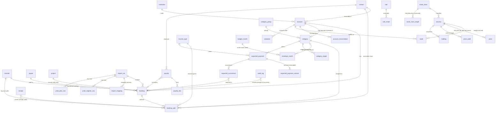

# Data model (schema v2)

SQLite (WAL) with Drizzle. Source: `packages/db/src/schema/*.ts`, migrations in `packages/db/drizzle/`
(`npm run db:generate` after a schema change), read and write functions in `packages/db/src/repos/`.
Everything the schema cannot express (split sums, transfer pairs, undo) is enforced in the
repositories and covered by tests on in-memory SQLite.

## Conventions

| Topic | Rule |
| --- | --- |
| Money | integer cents in `*_cents`, signed on bookings (outflow negative). Never floats. |
| Other numbers | rates in basis points (`*_bp`), prices and FX in micro-units (`*_micro`, 1e-6), units in 1e-8 (`*_e8`). Products of units and prices exceed 2^53, the domain converts with BigInt. |
| Dates | ISO text, `YYYY-MM-DD` for days, `YYYY-MM` for envelope months, ISO 8601 UTC for timestamps. |
| Deletion | nothing is hard-deleted: entity tables have `deleted_at`. Reads exclude soft-deleted rows unless asked. |
| Audit | every repository write appends to `audit_log` (before/after JSON, `group_id` per user action). `undo` reverts a group; undoing an undo is a redo. |
| Idempotent imports | `booking.import_key` is unique per account, also for soft-deleted rows, so a booking the user deleted is not imported again. |
| Enums | text columns with `CHECK ... IN (...)`, extended in v2 to everything the concept and the YNAB import need (trade kinds, category kinds, account types). |
| Formats | days and months are CHECKed (`GLOB` for `YYYY-MM-DD` / `YYYY-MM`); the repositories also check real calendar dates. |
| Migrations | `0003_ledger_model_v2` is the last one that rebuilds tables. From now on migrations are **additive only** (new tables, nullable or defaulted columns, indexes; `docs/ops.md` §11). `migrateDatabase` runs them with foreign keys off and then requires an empty `foreign_key_check`. |
| Ids | text, generated by the caller (UUID by default; the sample ledger uses readable ids). |

## Entity relationships

Not drawn: `savings_goal`, `planned_event`, `fx_rate` (ECB rate per day and currency),
`inbox_item`, `assignment_rule`, `bank_connection` (status and consent expiry only, no secrets),
the auth tables.

## Decisions

- **Envelope months store only `assigned_cents`.** Activity is the sum of the category's splits in
  the month, available is `carry + assigned + activity` (`envelopeMonth`/`envelopeSeries` in the
  domain). Storing derived values would let them drift from the bookings.
- **Category NULL on an inflow split means "Zu verteilen".** Whether a transfer is budget-neutral
  follows from the `on_budget` flag of both accounts (P1f-3 PR 2): between two budget accounts it
  is neutral; to or from a tracking account it moves money out of or into the budget and carries a
  category on its on-budget leg (loan payment, investing).
- **A loan payment is a categorised transfer plus interest on the loan account.** The rate is one
  transfer from the current account to the loan account with the category "Kreditrate"; interest is
  a booking on the loan account. Net worth then falls by exactly the interest, and the envelope
  shows the full payment as spent, as in the prototype.
- **Investment accounts are valued from holdings, not from their booking balance.** A savings-plan
  transfer arrives as cash on the investment account and a buy booking settles it (`trade.booking_id`),
  so the cash balance stays at 0; the value is units (`holding` snapshot plus later trades) times the
  latest `price`. Net worth = account balances (debts negative) + holdings at market value.
- **Prices carry their source** (`yfinance`, `ariva`, `manual`, `import`); one price per product and
  day. A failed fetch is an inbox item, not a missing row.
- **Expected payments are versioned** (`valid_from`), so a price increase changes the plan from that
  day on without rewriting history. Yearly payments use `due_month`. The 50/30/20 twelfths read
  from these versions.
- **Rules are data.** `rule.params_json` holds thresholds, e.g. R12 stores which share of a special
  payment goes to which envelope; `rule_result` stores status and value per evaluation.
- **`transfer` is a plain container row.** It is not audited or soft-deleted; undoing a transfer soft
  deletes both bookings and leaves the container row, which keeps foreign keys valid.
- **`booking_split` has no `deleted_at`.** Replacing splits deletes the old rows through the tracked
  writer, so the change is still in `audit_log` and can be undone.

- **Account type, role and on-budget are three separate facts** (C6). `type` is what the account
  is (Giro, Bargeld, Tagesgeld, Kreditkarte, Kredit, Depot, Krypto, P2P, Forderung, Sonstiges
  Vermögen, Sonstige Verbindlichkeit); `on_budget` decides whether its balance is money to
  distribute; `role` groups it for net worth and reports. A `reserve` account (Tagesgeld holding
  the Notgroschen envelope) is **on-budget**: its money is covered by envelopes like the current
  account's. Loan, depot, crypto, P2P and receivable accounts can never be on-budget (CHECK).
- **What a split means** (C3): a category (envelope activity, NULL on an inflow = "Zu verteilen"),
  optionally an **income type** (`income_type`, a list of its own: Gehalt, Sonderzahlung, Beiträge
  von Kontakten, Nebeneinkünfte, Kapitalerträge, Erstattungen, Geschenke, Sonstiges), a **contact**
  = receivable share per concept §3.4 (paid for or repaid by that contact; runs through the
  "Auslagen" envelope, category kind `advance`), or a **transfer** leg (`booking_split.transfer_id`,
  PR 2). The counterparty of a salary or a contribution is the payee (and the payee's contact),
  never `booking_split.contact_id`.
- **Category kinds** (C9): `fixed`, `periodic`, `variable`, `project`, `saving`, `invest`, `debt`,
  `advance` (Auslagen), `card_payment` (Kartenzahlung) and `income`. Income, card-payment and
  advance categories have no 50/30/20 class; every other category must have one. Stages are 1–9.
- **Credit cards** (C14, concept §3.1, rule R06): each card has one `card_payment` category
  (`card_account_id`, unique). A categorised spend on the card moves its amount from the spending
  category to that envelope (computed in the domain, PR 2, never stored as bookings); the payment
  from the current account is a neutral transfer between two budget accounts. The envelope cannot
  be booked directly. This is YNAB's "Credit Card Payments" group.
- **Month-level values** (`budget_month.held_cents`, C1): money held for next month. Categories may
  opt into `rollover_overspending` (Actual); by default negative available is not carried but
  reduces the next month's "Zu verteilen" (concept §5.3). Logic in PR 2.
- **Foreign currency** (C7): `original_amount_cents` is signed like `amount_cents`; the four fields
  (original amount, original currency, ECB rate, fee) are all set or all NULL (CHECK). The
  repository requires `amount = round(original × rate) + fee` within one cent; the fee is the
  bank's deviation, negative = cost, default 0.
- **YNAB import model** (C14, `docs/migration/ynab-export.md`): an `import_run` owns the raw
  staging rows (`ynab_register_row`, `ynab_plan_row`, text 1:1 after the CESU-8 repair) and the
  owner's mapping documents (`import_mapping`, one row per saved version). Target bookings carry
  `import_run_id`, so a run can be reverted as a whole. `Cleared` maps to the booking status:
  Uncleared → `pending`, Cleared → `confirmed`, Reconciled → `reconciled`. Future-dated rows are
  pending bookings with their future date; balances "as of" a day ignore them. YNAB flags become
  `booking.flag`. "Starting Balance", "Reconciliation Balance Adjustment" and "Manual Balance
  Adjustment" map to the system payees `payee-opening-balance`, `payee-reconciliation` and
  `payee-manual-adjustment` (`payee.system_kind`, inserted by the migration).
- **Kontoprüfung** (`account_reconciliation`): statement balance versus the app's cleared balance on
  a day; a difference becomes an adjustment booking with the reconciliation system payee.
- **Targets and plans are versioned, never overwritten** (C12): `category_target` by `valid_from`
  month (monthly amount, balance by a date, keep a balance), `asset_class_target` by day (share and
  band for R13), `expected_payment_version` by day and **immutable** (a trigger refuses changes to
  anything but `deleted_at`/`updated_at`; a price change is a new version). Occurrences
  (`expected_occurrence`) carry status (expected, received, deviating, missed), the contact share
  and the matched booking; the payment holds tolerance, date window and contact share.
- **Prices keep an audit and manual prices win** (C12): every change of an existing price is a
  `price_audit` row; a refresh never replaces a `manual` price. Manual account values
  (P2P, other assets) are `valuation` rows.
- **Receipts prove splits** (n:m, `receipt_split`); payslips link the employer contact and the
  salary booking.

## Sample ledger (`packages/fixtures`)

`npm run db:seed` writes `./data/dev.sqlite` (about 11 000 rows: 4 200 bookings with splits,
transfers and one foreign-currency subscription pair, 222 prices, 1 224 envelope months, versioned
expected payments, payslips, rules and results). Everything is synthetic and deterministic.

The generator is a TypeScript port of `design/prototype/reports-core.js`
(`packages/fixtures/src/reference/model.ts`, same random sequence, same arithmetic).
`prototype-parity.test.ts` runs the prototype itself in a sandbox and compares every array, so the
port cannot drift. `ledger/` turns the euro floats into integer-cent bookings:

- category activity per month equals the prototype's spend to the cent (34 categories x 36 months);
- income per month equals the prototype's income to the cent;
- net worth on 17.09.2026 is exactly 84.730,00 EUR; the opening balance of the savings account is the
  balancing figure that makes the anchor exact, everything else follows from bookings and prices;
- product values follow the prototype's value paths within 1 EUR at every month end.

`figures.test.ts` reproduces the acceptance figures from the seeded database through the
repositories and the domain functions: net worth 84.730 EUR, August 2026 allocation
54 / 33 / 26 / -13 %, TTWROR +12,4 % (12 months) and +38,2 % (since Oct 2023).
