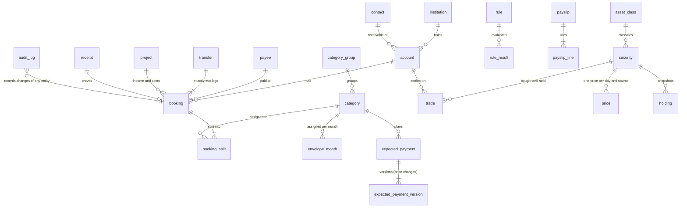

# Data model (schema v1)

SQLite (WAL) with Drizzle. Source: `packages/db/src/schema/*.ts`, migrations in `packages/db/drizzle/`
(`npm run db:generate` after a schema change), read and write functions in `packages/db/src/repos/`.
Everything the schema cannot express (split sums, transfer pairs, undo) is enforced in the
repositories and covered by tests on in-memory SQLite.

## Conventions

| Topic | Rule |
| --- | --- |
| Money | integer cents in `*_cents`, signed on bookings (outflow negative). Never floats. |
| Other numbers | rates in basis points (`*_bp`), prices and FX in micro-units (`*_micro`, 1e-6), units in 1e-8 (`*_e8`). Products of units and prices exceed 2^53, the domain converts with BigInt. |
| Dates | ISO text, `YYYY-MM-DD` for days, `YYYY-MM` for envelope months, ISO 8601 UTC for timestamps. |
| Deletion | nothing is hard-deleted: entity tables have `deleted_at`. Reads exclude soft-deleted rows unless asked. |
| Audit | every repository write appends to `audit_log` (before/after JSON, `group_id` per user action). `undo` reverts a group; undoing an undo is a redo. |
| Idempotent imports | `booking.import_key` is unique per account, also for soft-deleted rows, so a booking the user deleted is not imported again. |
| Enums | text columns with `CHECK ... IN (...)`. |
| Ids | text, generated by the caller (UUID by default; the sample ledger uses readable ids). |

## Entity relationships

Not drawn: `savings_goal`, `planned_event`, `fx_rate` (ECB rate per day and currency),
`inbox_item`, `assignment_rule`, `bank_connection` (status and consent expiry only, no secrets).

## Decisions

- **Envelope months store only `assigned_cents`.** Activity is the sum of the category's splits in
  the month, available is `carry + assigned + activity` (`envelopeMonth`/`envelopeSeries` in the
  domain). Storing derived values would let them drift from the bookings.
- **Category NULL on an inflow split means "Zu verteilen".** A transfer leg without category is
  budget-neutral; a transfer to a tracking or debt account may carry a category (loan payment,
  investing) on its outflow leg, which then counts as activity of that envelope.
- **A loan payment is a categorised transfer plus interest on the loan account.** The rate is one
  transfer from the current account to the loan account with the category "Kreditrate"; interest is
  a booking on the loan account. Net worth then falls by exactly the interest, and the envelope
  shows the full payment as spent, as in the prototype.
- **Investment accounts are valued from holdings, not from their booking balance.** A savings-plan
  transfer arrives as cash on the investment account and a buy booking settles it (`trade.booking_id`),
  so the cash balance stays at 0; the value is units (`holding` snapshot plus later trades) times the
  latest `price`. Net worth = account balances (debts negative) + holdings at market value.
- **Prices carry their source** (`yfinance`, `ariva`, `manual`, `import`); one price per product and
  day. A failed fetch is an inbox item, not a missing row.
- **Expected payments are versioned** (`valid_from`), so a price increase changes the plan from that
  day on without rewriting history. Yearly payments use `due_month`. The 50/30/20 twelfths read
  from these versions.
- **Rules are data.** `rule.params_json` holds thresholds, e.g. R12 stores which share of a special
  payment goes to which envelope; `rule_result` stores status and value per evaluation.
- **`transfer` is a plain container row.** It is not audited or soft-deleted; undoing a transfer soft
  deletes both bookings and leaves the container row, which keeps foreign keys valid.
- **`booking_split` has no `deleted_at`.** Replacing splits deletes the old rows through the tracked
  writer, so the change is still in `audit_log` and can be undone.

## Sample ledger (`packages/fixtures`)

`npm run db:seed` writes `./data/dev.sqlite` (about 11 000 rows: 4 200 bookings with splits,
transfers and one foreign-currency subscription pair, 222 prices, 1 224 envelope months, versioned
expected payments, payslips, rules and results). Everything is synthetic and deterministic.

The generator is a TypeScript port of `design/prototype/reports-core.js`
(`packages/fixtures/src/reference/model.ts`, same random sequence, same arithmetic).
`prototype-parity.test.ts` runs the prototype itself in a sandbox and compares every array, so the
port cannot drift. `ledger/` turns the euro floats into integer-cent bookings:

- category activity per month equals the prototype's spend to the cent (34 categories x 36 months);
- income per month equals the prototype's income to the cent;
- net worth on 17.09.2026 is exactly 84.730,00 EUR; the opening balance of the savings account is the
  balancing figure that makes the anchor exact, everything else follows from bookings and prices;
- product values follow the prototype's value paths within 1 EUR at every month end.

`figures.test.ts` reproduces the acceptance figures from the seeded database through the
repositories and the domain functions: net worth 84.730 EUR, August 2026 allocation
54 / 33 / 26 / -13 %, TTWROR +12,4 % (12 months) and +38,2 % (since Oct 2023).
