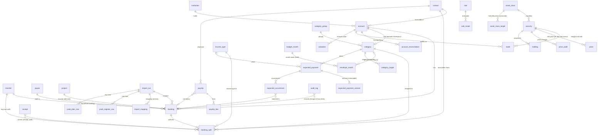

# Data model (schema v2)

PR3 adds account allocation_scope (included/excluded/default), account allocation_asset_class_id (optional deliberate cash/P2P class), and security allocation_included (default true). Drizzle migration 0032 freezes initial membership from types/settlement links while preserving all original source columns. Membership/cash class is current metadata; dated security exposures remain historical. No balances or trades are rewritten. See [allocation quality/scope](allocation-quality-scope.md).

Effective-dated security classification is stored in `security_exposure_version` and its weighted `security_asset_exposure` members. Inclusive dates, explicit incomplete sets, largest-remainder cents, audit/undo and the legacy seed-date assumption are defined in [historical asset exposure](asset-exposure.md). `security.asset_class_id` remains compatibility metadata; financial readers resolve versions at their own valuation date.

SQLite (WAL) with Drizzle. Source: `packages/db/src/schema/*.ts`, migrations in `packages/db/drizzle/`
(`npm run db:generate` after a schema change), read and write functions in `packages/db/src/repos/`.
Everything the schema cannot express (split sums, transfer pairs, undo) is enforced in the
repositories and covered by tests on in-memory SQLite.

## Conventions

| Topic | Rule |
| --- | --- |
| Money | integer cents in `*_cents`, signed on bookings (outflow negative). Never floats. |
| Other numbers | rates in basis points (`*_bp`), prices and FX in micro-units (`*_micro`, 1e-6), units in 1e-8 (`*_e8`). Products of units and prices exceed 2^53, the domain converts with BigInt. |
| Dates | ISO text, `YYYY-MM-DD` for days, `YYYY-MM` for envelope months, ISO 8601 UTC for timestamps. |
| Deletion | nothing is hard-deleted: entity tables have `deleted_at`. Reads exclude soft-deleted rows unless asked. |
| Audit | every repository write appends to `audit_log` (before/after JSON, `group_id` per user action). `undo` reverts a group; undoing an undo is a redo. |
| Idempotent imports | `booking.import_key` is unique per account, also for soft-deleted rows, so a booking the user deleted is not imported again. |
| Enums | text columns with `CHECK ... IN (...)`, extended in v2 to everything the concept and the YNAB import need (trade kinds, category kinds, account types). |
| Formats | days and months are CHECKed (`GLOB` for `YYYY-MM-DD` / `YYYY-MM`); the repositories also check real calendar dates. |
| Migrations | `0003_ledger_model_v2` is the last one that rebuilds tables. From now on migrations are **additive only** (new tables, nullable or defaulted columns, indexes; `docs/ops.md` §11). `migrateDatabase` runs them with foreign keys off and then requires an empty `foreign_key_check`. |
| Ids | text, generated by the caller (UUID by default; the sample ledger uses readable ids). |

## Entity relationships

`category.pinned_at` (nullable timestamp) pins an envelope to Heute; pinned envelopes are ordered by it.

Not drawn: `savings_goal` (linked to a category or an account, never both; figures are computed, not stored), `planned_event`, `fx_rate` (ECB rate per day and currency),
`inbox_item`, `assignment_rule`, `bank_connection` (status and consent expiry only, no secrets),
the auth tables.

## Decisions

- **Envelope months store only `assigned_cents`.** Activity is the sum of the category's splits in
  the month, available is `carry + assigned + activity` (`envelopeMonth`/`envelopeSeries` in the
  domain). Storing derived values would let them drift from the bookings.
- **One function computes the budget** (C1, C2): `budgetMonths` in `packages/domain` (fed by the
  read model `budget(db, months)`) returns every envelope and "Zu verteilen" per month:
  - carry = `max(0, available of the previous month)` for every kind (concept §5.3, YNAB); with
    `category.rollover_overspending` the negative amount is carried instead (Actual). Overspending
    that is not carried is `uncoveredCents` of the next month;
  - **Zu verteilen(m) = Σ cash balances at the end of m − Σ available(m) − held(m)** (stock
    formula). Cash = on-budget accounts, except credit cards that have a `card_payment` envelope
    (their debt is covered by that envelope). `toBeAssignedFlow` is the same figure as a flow
    (previous + income − assigned − uncovered + held before − held now); a property test over 200
    random ledgers checks that both agree every month;
  - only splits on on-budget accounts count. A transfer leg whose other account is also on-budget
    is neutral, even if it carries a category; any other uncategorised split (income, refund,
    a transfer from a tracking account) goes to "Zu verteilen". Deleted accounts are ignored;
    splits of a deleted category count as uncategorised;
  - a card envelope's activity is the negative of every booking on its card (spending moves money
    in, a payment moves it out). Card debt that no envelope covers (e.g. an opening balance) stays
    visible as the difference between the card balance and the envelope;
  - a budget account opened within the period brings its opening balance as income.
- **One opening-date rule** (C5), in the domain (`balanceOn`) and in SQL (`accountBalances`): an
  account is 0 before its `opening_date`; from that day on it is the opening balance plus every
  booking dated on or after it (earlier bookings belong to the opening balance).
- **Category NULL on an inflow split means "Zu verteilen".** Whether a transfer is budget-neutral
  follows from the `on_budget` flag of both accounts: between two budget accounts it is neutral and
  the repository refuses a category; to or from a tracking account it moves money out of or into
  the budget, and `createTransfer` puts the category on the on-budget leg (loan payment, investing,
  money back from the depot). The sample ledger keeps the prototype's category on the monthly
  Notgroschen transfer (Giro → Tagesgeld) so its category sums match `reports-core.js`; the budget
  treats it as neutral, as `plan.js` does (activity 0, the envelope accumulates).
- **Split-level transfers** (C4): a split with `transferAccountId` becomes one leg; the repository
  creates the other leg as a booking with the opposite amount on the same day. A transfer always has
  exactly two live legs (whole bookings or split + booking) with opposite amounts; both sides are
  deleted and restored together, amounts and dates change only by re-creating. `importTransfer` is
  idempotent: an existing pair (or a leg the user deleted) is left alone, two plain imported legs
  are linked, a missing leg is created.
- **Undo keeps the invariants** (C8): a single audit entry of a split or a transfer leg cannot be
  undone, only its group. After every undo the split sums and transfer pairs of the touched bookings
  are checked inside the same transaction (also with `force`), so an undo can never leave an
  unbalanced booking or a one-legged transfer; the check lives in `repos/invariants.ts` and also
  runs after every booking write.
- **A loan payment is a categorised transfer plus interest on the loan account.** The rate is one
  transfer from the current account to the loan account with the category "Kreditrate"; interest is
  a booking on the loan account. Net worth then falls by exactly the interest, and the envelope
  shows the full payment as spent, as in the prototype.
- **Positions are per account and security** (C10): `holdingValuesAsOf` keys units by
  (account, security) — latest snapshot of that account plus its later trades — and values them at
  the latest price, converted to EUR with the stored ECB rate of the price currency (one rounding,
  `marketValueEurCents`); a missing rate is an error, never a silent 0. `netWorthAsOf` adds every
  account's balance in EUR (foreign-currency accounts converted) and its positions; it is the one
  net-worth calculation (the debug summary uses it too). Cost basis: `averageCost` and `fifoCost`
  (both with realised gain, splits and deliveries). Returns with cash flows in the domain:
  `ttwror` (sub-periods between valuations), `modifiedDietz` and `irr` (XIRR, actual/365).
- **Daily series and performance** (P5.2, no schema change). Domain `invest/series.ts`:
  `dailyValuation` (units x price carried forward x FX of the day, one rounding), `securityFlows`
  (Portfolio Performance "securities only": buys in, sales/dividends/interest out, standalone
  fee/tax as an inflow that lowers the gain, split none) and `depotFlows` ("depot incl. reference
  account": transfers across the portfolio boundary and deliveries in/out count; this is the Gate 3 view).
  `invest/performance.ts`: `periodWindow('1M'|'3M'|'YTD'|'1J'|'3J'|'Alles')`, `windowPerformance`
  (start/end value, contributions, gain in cents; TTWROR chained over daily sub-periods; XIRR;
  Modified Dietz annualised beyond 12 months = the prototype's "IRR"; volatility = monthly
  deviation x sqrt 12, max drawdown, Sharpe with 2,5 %, beta vs the benchmark, best/worst month,
  share of positive months). Rates are doubles and never rounded in the domain (the formatter
  rounds once); money stays integer. Pages show TTWROR and the Dietz variant (prototype parity),
  the Gate 3 report compares XIRR and TTWROR. `invest/cost.ts`: one `costOf` (FIFO default,
  `'average'` available), `gainOf`, `terOf`, `realizedGainIn`, `incomeLast12Months`,
  `fundCosts` (TER on month ends plus fees of 12 months over the value, in bp). Read models in
  `repos/portfolio.ts`: `valuationSeries` (one pass, equals `holdingValuesAsOf` on every day),
  `cashSeries`, `portfolioFlows(view: 'securities' | 'depot')`, `netWorthDaily` (equals
  `netWorthAsOf` on every day; own = change - market, market = value change of positions minus
  the gross money traded in). Manual `valuation` rows are not part of net worth yet (as in
  `netWorthAsOf`). The prototype's `windowK('3J')` drops the first month (39,7 %); `PERF` and
  the domain use all 36 months (38,2 %); `PERF`'s 3J IRR of 10,6 % is stale, its own formula
  gives 11,2 % (`performance-parity.test.ts`).
- **Savings plans** (P5.5, migration 0008): `savings_plan` = security, investment account, source
  account, rate in cents, `day_of_month` (31 = last day), `valid_from` and `valid_to` (inclusive,
  `NULL` = open). A rate change never edits a row: it ends the current one the day before and starts
  a new one, so past months keep their rate. The bank executes plans; `matchExecutions` compares
  the planned execution with the buys (3 days either side). Applying a proposal also opens an inbox
  item, because the bank does not follow.
- **Trades settle through a booking** (P5.5): every trade that moves money has one booking on its
  investment account (`trade.booking_id`) in the same audit group (`settlementCents` in the
  domain). Asset-class targets are versions of 10 000 bp each (`setTargets`).
- **Depot view deposits and withdrawals** (P5.5): next to transfers across the boundary, a plain booking onto
  a reference account (not a trade settlement, not income type Kapitalerträge) is an external flow.
  A delivery in or out (`delivery_in` / `delivery_out`, also the legs of a transfer between portfolios)
  is capital in or out at its stored amount, as in Portfolio Performance (owner decision
  02.10.2026); two accounts of the same depot net out.
- **Verrechnungskonto** (P5.11): `account.reference_account_id` (nullable, self reference) links a depot to the account it settles through, so a platform (cash account plus securities account) can be grouped and shown ("Verrechnungskonto: …"). It is a link only: money between the two moves by transfers, and a trade still settles on its own account.
- **PP migration tables** (P5.11, `docs/ops.md` §13): `import_file` (the staged files of a run as bytes, the PP XML and the platform statements, `kind` `pp-xml` or `statement:<PP cash account uuid>`,
  deletable) and `import_price_change` (per run, security and day: a price the run
  inserted has no old value, one it replaced keeps old price, currency and source). Prices are not
  in `audit_log`, so this table is the run's undo record for them. A PP run is an `import_run` with
  source `portfolio_performance`; its securities, trades, settlement bookings, asset classes,
  opening-balance changes and retired adjustments are one audit group `import:<run id>`.
  A live refresh may replace imported prices of its first 30 days (audited in `price_audit`); a `manual` price always wins.
- **Read models and dates** (C11): `allocationMonth(db, month)` assembles the 50/30/20 inputs
  (regular income = uncategorised inflow splits on budget accounts without the income type
  Sonderzahlung; periodic and windfall categories from the expected payments and rule R12) for the
  domain's `allocation`. `packages/domain/src/date` has "today" in Europe/Vienna and the month
  arithmetic. `percentShares` rounds by largest remainder and always adds up to 100 (all rest
  without income). Opening envelopes are `category.opening_available_cents` (migration 0004,
  additive), not part of the first month's assignment; `budget(db, months)` always starts at the
  budget start so they apply.
- **Investment accounts are valued from holdings, not from their booking balance.** A savings-plan
  transfer arrives as cash on the investment account and a buy booking settles it (`trade.booking_id`),
  so the cash balance stays at 0; the value is units (`holding` snapshot plus later trades) times the
  latest `price`. Net worth = account balances (debts negative) + holdings at market value.
- **Market data sources** (P5.1, `docs/market-data.md`): `security.quote_url` is the quote page as PP
  stores it (Ariva, or cryptocalc as the fallback of a crypto security without a coin id; https only), `quote_exchange` the Ariva
  `boerse_id`, `coingecko_id` the CoinGecko coin id (primary source of crypto prices), `symbol` the Yahoo symbol (last resort);
  `fallback_quote_id` is a legacy field no source reads. `prices_enabled` switches the daily refresh
  off, `quote_adjusted` asks for the adjusted close (default: plain). `fx_rate` is EUR per one unit:
  the ECB publishes units per EUR, the value is inverted on integers (10^12 / x, rounded half up
  once). The refresh fetches from the day after the newest network price (first time: 30 days back);
  a `manual` price never moves that start. `market_run` is the run log of the refresh (time, status,
  counts, error classes); its newest `ok`/`partial` row is the "Stand ... Kurse" time.
- **Prices carry their source** (`ariva`, `coingecko`, `cryptocalc`, `yfinance`, `manual`, `import`); one price per product and
  day. A failed fetch is an inbox item, not a missing row.
- **Expected payments are versioned** (`valid_from`), so a price increase changes the plan from that
  day on without rewriting history. Yearly payments use `due_month`. The 50/30/20 twelfths read
  from these versions.
- **Rules are data.** `rule.params_json` holds thresholds (one zod schema per rule in
  `packages/domain/src/rules/params.ts`, defaults from concept §3.5), e.g. R12 stores which share of a
  special payment goes to which envelope; `rule_result` stores status, value and action per evaluation,
  unique per (rule, day). `rule.kind` is `rule` (registered rules (`RULE_CODES`)) or `checklist` (a stage item from the books;
  `params_json.ruleCode` links it to a rule, otherwise the owner sets `confirmed_at`). `ensureDefaultRules`
  writes the book at start and never overwrites what the owner changed.
- **`transfer` is a plain container row.** It is not audited or soft-deleted; undoing a transfer soft
  deletes both bookings and leaves the container row, which keeps foreign keys valid.
- **`booking_split` has no `deleted_at`.** Replacing splits deletes the old rows through the tracked
  writer, so the change is still in `audit_log` and can be undone.

- **Account type, role and on-budget are three separate facts** (C6). `type` is what the account
  is (Giro, Bargeld, Tagesgeld, Kreditkarte, Kredit, Depot, Krypto, P2P, Forderung, Sonstiges
  Vermögen, Sonstige Verbindlichkeit); `on_budget` decides whether its balance is money to
  distribute; `role` groups it for net worth and reports. A `reserve` account (Tagesgeld holding
  the Notgroschen envelope) is **on-budget**: its money is covered by envelopes like the current
  account's. Loan, depot, crypto, P2P and receivable accounts can never be on-budget (CHECK).
- **What a split means** (C3): a category (envelope activity, NULL on an inflow = "Zu verteilen"),
  optionally an **income type** (`income_type`, a list of its own: Gehalt, Sonderzahlung, Beiträge
  von Kontakten, Nebeneinkünfte, Kapitalerträge, Erstattungen, Geschenke, Sonstiges), a **contact**
  = receivable share per concept §3.4 (paid for or repaid by that contact; runs through the
  "Auslagen" envelope, category kind `advance`), or a **transfer** leg (`booking_split.transfer_id`,
  PR 2). The counterparty of a salary or a contribution is the payee (and the payee's contact),
  never `booking_split.contact_id`.
- **Category kinds** (C9): `fixed`, `periodic`, `variable`, `project`, `saving`, `invest`, `debt`,
  `advance` (Auslagen), `card_payment` (Kartenzahlung) and `income`. Income, card-payment and
  advance categories have no 50/30/20 class; every other category must have one. Stages are 1–9.
- **Credit cards** (C14, concept §3.1, rule R06): each card has one `card_payment` category
  (`card_account_id`, unique), YNAB's "Credit Card Payments" group. The envelope cannot be booked
  directly; the payment from the current account is a neutral transfer between two budget
  accounts that takes money out of it. What a categorised card spend moves is computed in the
  domain (`budgetMonths`, never stored as bookings), by `cardRule`:
  - **`'ynab'`, default (owner decision 30.09.2026, P1f-6):** month-level YNAB rule. Only the
    **funded** part moves into the card envelope: what the category covers at month end, so
    covering it later in the month funds the card retroactively. The rest is **credit
    overspending**: new card debt (`cardDebtGrowthCents` per card), the category resets to 0 next
    month, and it does not reduce the next month's "Zu verteilen"; only **cash overspending**
    does (`uncoveredCents`). A category overspent by cash and card in the same month counts the
    cash first ("takes the cash out first, since those dollars have actually left your bank
    account", YNAB help "Handling Overspending"; the page itself could not be opened from the
    build environment, only its search excerpt, so this is to be confirmed with the synthetic
    export of P2d). The credit part is shared over several cards in proportion to their spending
    (largest remainder). Refunds in a category move their full amount back; categories with
    `rollover_overspending` carry their overspending themselves and move card spending in full.
    Stock formula: Zu verteilen = cash − Σ available − held − credit overspending of the month.
    Per month and category `fundedCardCents`, `creditOverspentCents`, `cashOverspentCents`.
    A transfer from the card to a budget account without a card envelope (**cash advance**, e.g.
    paying an online wallet with the card) does not move the envelope: it is new card debt, and
    the money arriving in the budget account is new money in "Zu verteilen" (YNAB help "Credit
    Card Cash Advances": the funds leave the card, move to the cash account and increase Ready to
    Assign; matches the owner's first real import). Paying that debt later from the
    current account takes the envelope below 0 like any payment without cover.
  - **`'concept'`:** every card spend moves in full, all overspending is cash overspending. Kept
    so the reconciliation can show both during the parallel run (`budget(db, months, { cardRule })`).
- **Month-level values** (`budget_month.held_cents`, C1): money held for next month. Categories may
  opt into `rollover_overspending` (Actual); by default negative available is not carried but
  reduces the next month's "Zu verteilen" (concept §5.3). Logic in PR 2.
- **Foreign currency** (C7): `original_amount_cents` is signed like `amount_cents`; the four fields
  (original amount, original currency, ECB rate, fee) are all set or all NULL (CHECK). The
  repository requires `amount = round(original × rate) + fee` within one cent; the fee is the
  bank's deviation, negative = cost, default 0.
- **YNAB import model** (C14, `docs/migration/ynab-export.md`): an `import_run` owns the raw
  staging rows (`ynab_register_row`, `ynab_plan_row`, text 1:1 after the CESU-8 repair) and the
  owner's mapping documents (`import_mapping`, one row per saved version). Target bookings carry
  `import_run_id`, so a run can be reverted as a whole. `Cleared` maps to the booking status:
  Uncleared → `pending`, Cleared → `confirmed`, Reconciled → `reconciled`. Future-dated rows are
  pending bookings with their future date; balances "as of" a day ignore them. YNAB flags become
  `booking.flag`. "Starting Balance", "Reconciliation Balance Adjustment" and "Manual Balance
  Adjustment" map to the system payees `payee-opening-balance`, `payee-reconciliation` and
  `payee-manual-adjustment` (`payee.system_kind`, inserted by the migration).
  The pure importer (`packages/import-ynab`) produces the target model these tables receive:
  accounts with `openingDate`/`openingBalanceCents` at the start month, bookings with splits
  (`transferId` shared by both legs), `budget_month` assignments per target category and the opening
  Available per target category (`openingCarry` of `budgetMonths`).
- **Kontoprüfung** (`account_reconciliation`): statement balance versus the app's cleared balance on
  a day; a difference becomes an adjustment booking with the reconciliation system payee.
  `reconcileAccount` (P2a) does it in one transaction and one audit group: remove chosen
  duplicates, confirm chosen pending bookings, book the Ausgleich if asked, stamp every confirmed
  booking up to the day `reconciled`, store the snapshot. The cleared balance counts `confirmed`
  and `reconciled` bookings only; pending ones are outside the check.
- **Reconciled bookings are locked** (P2a): `updateBooking` and `deleteBooking` refuse to change
  amount, date, account, splits, payee, status or to delete a `reconciled` booking (or the partner
  leg of a transfer whose date or amount would follow) unless `unlockReconciled` is passed;
  `flag` and `memo` stay free. An unlocked edit keeps the status.
- **Targets and plans are versioned, never overwritten** (C12): `category_target` by `valid_from`
  month (monthly amount, balance by a date, keep a balance), `asset_class_target` by day (share and
  band for R13), `expected_payment_version` by day and **immutable** (a trigger refuses changes to
  anything but `deleted_at`/`updated_at`; a price change is a new version). Occurrences
  (`expected_occurrence`) carry status (expected, received, deviating, missed), the contact share
  and the matched booking; the payment holds tolerance, date window, contact share and the date
  shift (`date_shift`: none, before, after a weekend or Austrian holiday). A booking belongs to at
  most one live occurrence (partial unique index on `booking_id`).
- **Prices keep an audit and manual prices win** (C12): every change of an existing price is a
  `price_audit` row; a refresh never replaces a `manual` price. Manual account values
  (P2P, other assets) are `valuation` rows.
- **Receipts prove splits** (n:m, `receipt_split`); payslips link the employer contact and the
  salary booking.

## Sample ledger (`packages/fixtures`)

`npm run db:seed` writes `./data/dev.sqlite` (about 11 000 rows: 4 200 bookings with splits,
transfers and one foreign-currency subscription pair, 222 month-end prices (plus about 3 700 daily
prices and 700 daily USD rates between them, from the fixture market sources), 1 224 envelope months, versioned
expected payments, payslips, rules and results). Everything is synthetic and deterministic.

The generator is a TypeScript port of `design/prototype/reports-core.js`
(`packages/fixtures/src/reference/model.ts`, same random sequence, same arithmetic).
`prototype-parity.test.ts` runs the prototype itself in a sandbox and compares every array, so the
port cannot drift. `ledger/` turns the euro floats into integer-cent bookings:

- category activity per month equals the prototype's spend to the cent (34 categories x 36 months);
- income per month equals the prototype's income to the cent;
- net worth on 17.09.2026 is exactly 84.730,00 EUR; the opening balance of the savings account is the
  balancing figure that makes the anchor exact, everything else follows from bookings and prices;
- product values follow the prototype's value paths within 1 EUR at every month end.

Cases the prototype has no example for (`ledger/coverage.ts`, C13) are added so that every
prototype figure stays exact: a sale and re-purchase of one ETF unit in a second depot (a sale,
one security in two accounts, depot → current account → second depot), a distribution with fee
and tax paid net to the savings account (that month's interest is smaller by the same amount), a
soft-deleted duplicate booking, a US-dollar account that is empty at every month end, and a card
payment from the savings account so the card is at −450 € on 17.09.2026.

`figures.test.ts` reproduces the acceptance figures from the seeded database through the read
models and the domain functions: net worth 84.730 EUR with the prototype's account split, net
worth at all 36 month ends within 2 cents, August 2026 allocation in cents (310.103 / 192.865 /
150.888 of 575.788; shares 54 / 34 / 26 / -14 % by largest remainder, the prototype shows
54 / 33 / 26 / -13 with the rest absorbing the rounding), TTWROR +12,4 % (12 months) and +38,2 %
(since Oct 2023), and determinism of bookings, splits, trades, prices, envelopes and the budget.
